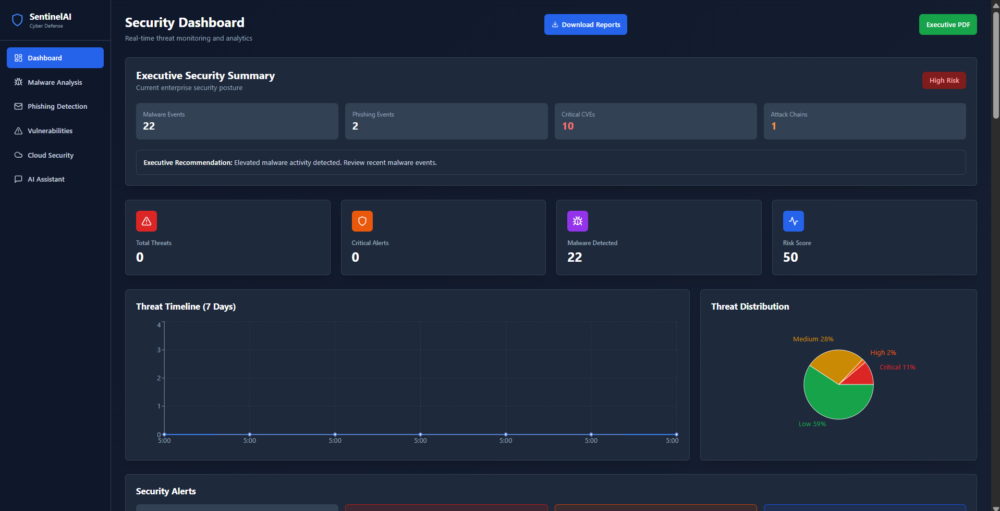
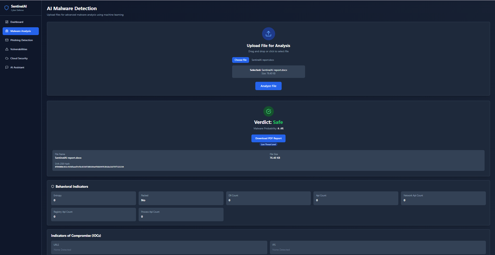
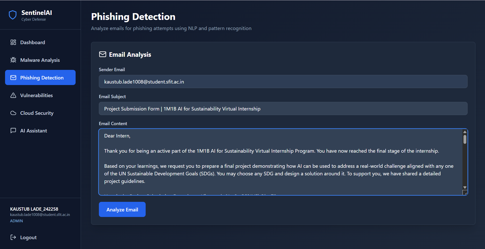
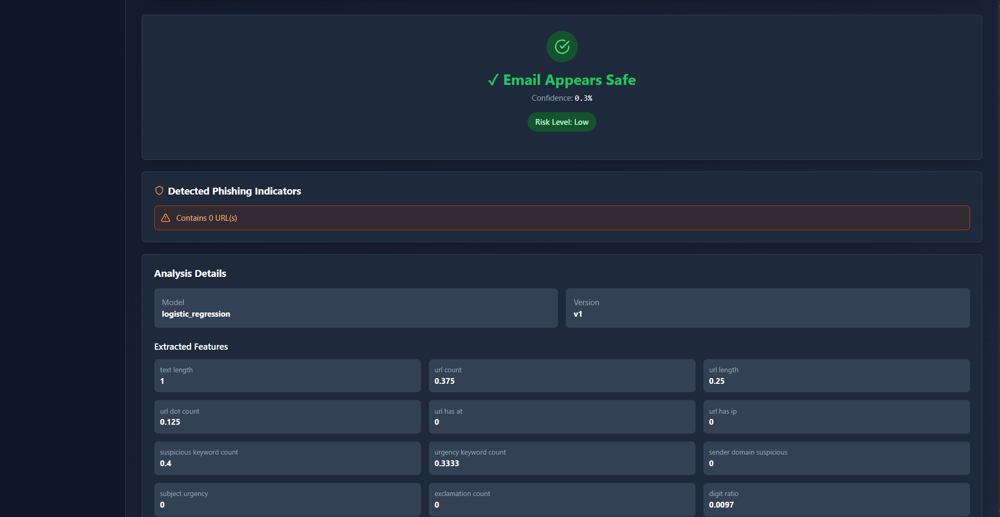
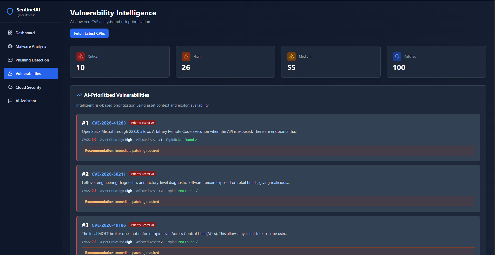
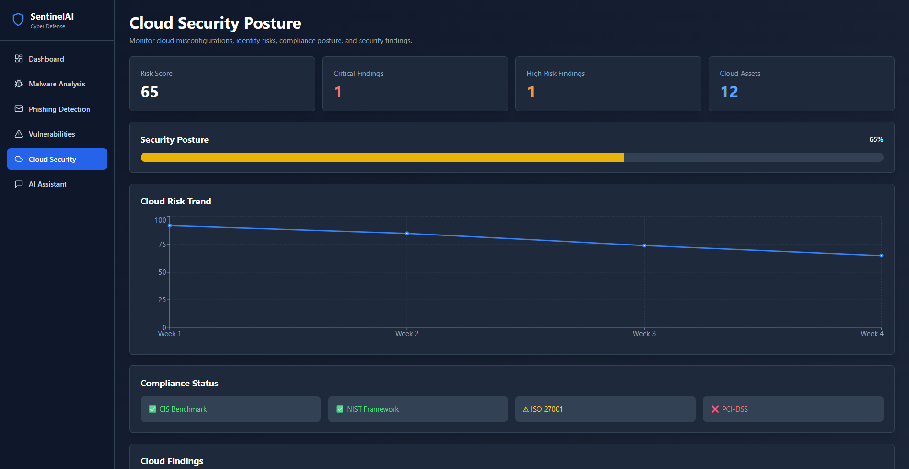
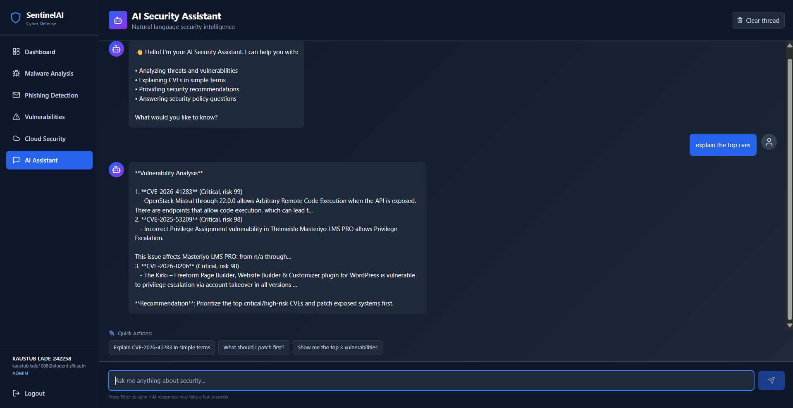

# SentinelAI: Autonomous Cyber Defense Platform

**SentinelAI** is a professional-grade, AI-powered cybersecurity platform designed for autonomous threat detection, phishing analysis, and vulnerability prioritization. Built to streamline security operations, it integrates machine learning models with industry-standard frameworks like MITRE ATT&CK to provide a unified defense interface.

---

## 1. Project Overview
SentinelAI functions as a comprehensive security ecosystem, combining a **React-based frontend** with a **FastAPI backend** to monitor and mitigate digital threats. It leverages AI to assist security analysts in identifying malware, analyzing phishing attempts, and prioritizing vulnerabilities based on real-time intelligence.

## 2. Problem Statement
Modern organizations face an overwhelming volume of security alerts and complex threat landscapes. Manual analysis of malware, phishing, and CVEs (Common Vulnerabilities and Exposures) is time-consuming and prone to human error, leading to delayed response times and increased risk of exploitation.

## 3. Objectives
*   To automate the detection and analysis of malware using static features and YARA hooks.
*   To provide an AI-driven security assistant for real-time threat interrogation.
*   To prioritize vulnerabilities using intelligent CVE assessment.
*   To map detected threats to the MITRE ATT&CK framework for standardized reporting.
*   To deliver executive-level reporting through automated PDF generation.

## 4. Key Features
*   **AI-Powered Detection:** Heuristic and machine learning for phishing and malware analysis.
*   **Vulnerability Intelligence:** Automated CVE prioritization to focus on critical risks.
*   **Security Assistant:** An integrated AI UI for security-related queries and assistance.
*   **Enterprise Security:** Role-Based Access Control (RBAC), audit logging, and JWT authentication with refresh tokens.
*   **Observability:** Integrated security and observability using Docker Compose.

## 5. Highlights

- AI-powered malware analysis
- NLP-based phishing detection
- CVE prioritization and risk scoring
- MITRE ATT&CK mapping
- Cloud security posture monitoring
- Executive PDF reporting
- AI Security Assistant powered by Groq

## 6. System Architecture Overview
The platform follows a modern microservices-inspired architecture:
*   **Frontend:** A responsive UI built with React, Vite, and Tailwind CSS.
*   **Backend:** High-performance API powered by FastAPI (Python).
*   **Data Tier:** MongoDB Atlas for flexible, cloud-native data storage.
*   **Task Management:** Celery and Redis for handling asynchronous security tasks and queues.
*   **AI Engine:** Integration with Groq for production-grade LLM capabilities.

## 7. Technology Stack
*   **Languages:** Python (40.7%), JavaScript (23.1%), Jupyter Notebooks (34.7%).
*   **Frameworks:** FastAPI, React.
*   **Database:** MongoDB Atlas.
*   **DevOps & Infrastructure:** Docker, Docker Compose, Vercel (Frontend), Render (Backend).
*   **AI/ML:** Groq LLM, YARA, Pydantic.

## 8. Module Descriptions
*   **Malware Detection:** Utilizes static feature analysis and YARA hooks supported by model for binary and file analysis.
*   **Phishing Detection:** Employs a combination of heuristic rules and machine learning to identify malicious URLs and communications.
*   **Vulnerability Intelligence:** Aggregates CVE data and provides prioritization intelligence to help teams patch critical flaws first.
*   **MITRE ATT&CK Mapping:** Includes map identified threats to specific tactics and techniques within the MITRE ATT&CK matrix.
*   **IOC Intelligence:** (Handled through the threat detection modules for identifying Indicators of Compromise).
*   **Threat Correlation Engine:** Integrated within the backend to link various security events (implied by platform scope).
*   **Security Assistant:** A specialized UI component that allows users to interact with an AI trained for security contexts.
*   **Cloud Security Monitoring:** Supported by dedicated security and observability for cloud-native environments.
*   **Alert Management:** Features rate limiting and audit logging to manage and track security alerts efficiently.
*   **Executive Reporting:** Includes functionality for automated "Executive PDF" creation for high-level stakeholders.

## 9. Folder Structure
```text
SentinelAI/
├── .github/workflows/    # CI/CD pipelines
├── backend/              # FastAPI source code, models, and API logic
├── frontend/             # React source code and UI components
├── ember-master/         # Additional project modules
├── docker-compose.yml    # Orchestration for local development
├── DEPLOYMENT.md         # Production configuration guides
└── README.md             # Project documentation
```

## 10. Installation Instructions
### Prerequisites
*   Python 3.x
*   Node.js & npm
*   Docker & Docker Compose

### Setup
1.  **Backend:**
    *   Navigate to `/backend`.
    *   Configure the `.env` file with MongoDB and Groq API credentials.
    *   Install dependencies (refer to `runtime.txt` for specific versions).
2.  **Frontend:**
    *   Navigate to `/frontend`.
    *   Set the `.env` file with the `ALLOWED_ORIGINS` and Backend API URL.
3.  **Run with Docker:**
    *   Use `docker-compose up` to start the backend, frontend, and Redis services simultaneously.
4.  **Local Scripts:**
    *   Windows users can use `start-all.bat`, `start-backend.bat`, or `start-frontend.bat` for quick startup.

## 11. API Overview
SentinelAI provides a fully documented REST API:
*   **API Documentation:** Accessible via `/docs` (Swagger UI) when the backend is running.
*   **Base URL:** `https://sentinelai-3glx.onrender.com/docs`.
*   **Key Endpoints:** Includes authentication, threat analysis, and vulnerability reporting.

## 12. Dashboard Features
*   **Real-time Threat Monitoring:** Visualizing active malware and phishing threats.
*   **Vulnerability Priority List:** A ranked view of CVEs affecting the environment.
*   **Interactive AI Chat:** The Security Assistant interface for direct query handling.

## 13. Security Features
*   **Authentication:** JWT with refresh token rotation.
*   **Authorization:** Role-Based Access Control (RBAC) and role checks.
*   **Infrastructure Security:** Atlas TLS hardening and secure production LLM configurations.
*   **Accountability:** Full audit logging for user and system actions.

## 14. Screenshots Section
### Security Dashboard


### AI Malware Detection


### Phishing Detection



### Vulnerability Intelligence


### Cloud Security Posture


### AI Security Assistant


## Live Demo

Frontend: https://sentinel-ai-flame.vercel.app/login

API Documentation:
https://sentinelai-3glx.onrender.com/docs

## Demo Credentials

Use the following demo account to explore the platform:

```text
Email: demo@sentinelai.com
Password: Demo@123
```

> Note: This is a demonstration account with limited privileges and sample security data.

## 15. Future Scope
*   Expansion of MITRE ATT&CK mapping to full automation.
*   Enhanced model training for more granular malware classification.
*   Extended cloud security integrations as noted in the project roadmap (`TODO.md`).

## 16. Authors
*   **Kaustub Lade** - *Lead Developer*

## 17. License
This project is part of a professional portfolio and engineering submission. Please refer to the repository for specific licensing details (e.g., MIT/Apache).